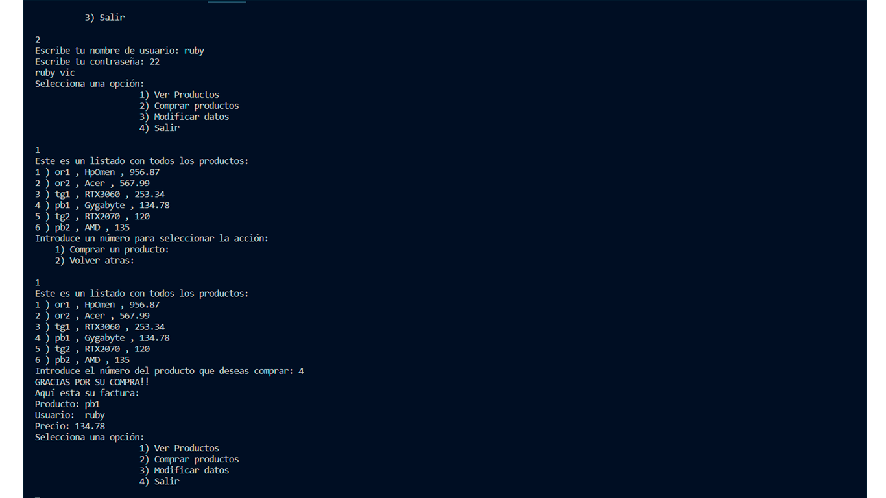

# Backend tienda python

Desarrollo simple del backend de una tienda con python utilizando POO y archivos de texto que guardan los datos de la tienda.

## Como usuarios podemos:
* Registrarnos
* Logearnos
* Cambiar nuestos datos
* Ver productos
* Comprar productos
  
## Como administradores podemos:
* Crear Productos
* Borrar Productos
* Actualizar Productos
* Eliminar usuarios
  
## Otras funciones:
* Cuando un usuarios reliza una compra automaticamnete genera una factura con los productosy precios de lo que ha comprado

